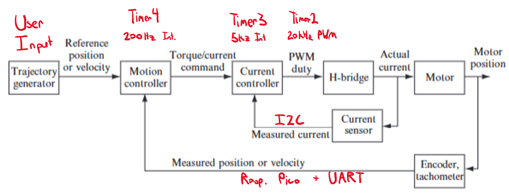
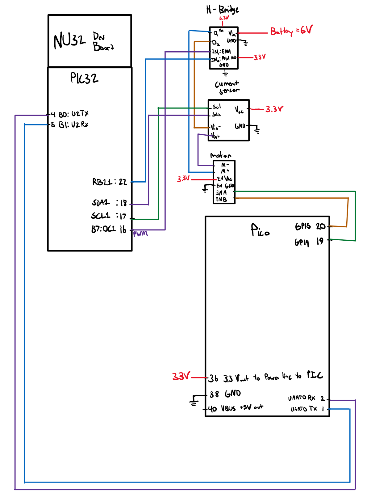
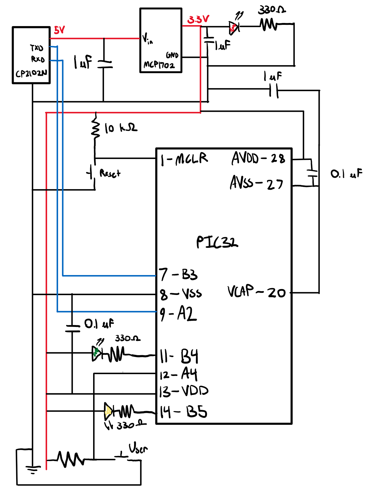
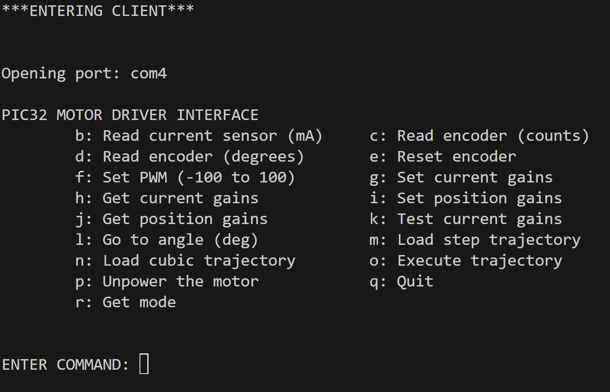

## PID Motor Controller and Client
**Author: Jared Berry**

This project was associated with Northwestern University ME 333: Mechatronics (Winter 2025).

#### Objective
The goal of this project was to create a motor controller in C on the PIC32MX270F256B microcontroller, with a Python client.

#### Hardware and Project Description
The motor controller and command menu is a robust interface that allows the user to specify constant speeds, contstant postions,
step trajectories, and cubic trajectories. There are also commands for reading sensors and internal controller state. 

The motor is controlled using a variable 20 kHz PWM signal, the duty cycle of which is controlled by a PID controller inside a 5kHz ISR. The user can specify a constant PWM with duty cycle between -100 and 100 (bidirectional). An additional 200 Hz ISR with a PID position controller can be used to hold a constant angle or follow either a step or cubic trajectory. This is accomplished by calculating a desired motor torque, and then using the current controller to follow the current required for this torque. The Python client plots both reference and followed trajectories, and calculates a performance score.

The motor controller code runs on the PIC32 microcontroller, which controls most of the logic and runs on a 3.3V power supply. A Raspberry Pi Pico Mini is also used for reading the motor encoder data, which is then sent to the PIC32 with a UART connection. The PIC32 communicates with an INA219 current sensor using an I2C protocol for accurate motor current measurements. Lastly, a bidirectional H-Bridge with an external 6V power supply is used to allow for robust control of the motor. The PIC32 microcontroller is part of a circuit named the NU32 Dev Board, which is a breadboard setup used throughout the course. The controller circuit diagram is pictured below, followed by the diagram for the NU32 Dev Board.

Lastly, the Python client provides the user with a wide array of commands to access the controller's various capabilities. It also contains functions for trajectory generation and plotting.

#### Software Format
The software is split up into modules, each controlling a different task, peripheral, or sensor. Each module contains a header file and a corresponding .c file.

- current_control 
This module contains functions for PID current control, based on user inputted gains. It also contains functions for setting up the current sensor, creating reference signal arrays, and communicating with the client.

- encoder 
This module contains functions for reading raw encoder data, converting to degrees, and setting up the UART connection to the Raspberry Pi Pico.

- i2c_master_noint 
This file contains I2C master utilities, 400 kHz, using polling rather than interrupts. The functions must be callled in the correct order as per the I2C protocol

- ina219 
This file contains code for initializing and readng the INA219 current sensor.

- main 
This module interfaces with the Python terminal to allow user input. It contains the command directory, and also
initializes all sensors and peripherals. 

- nu32dip 
This module provides the setup code written by Nick Marchuk for the NU32 Dev Board.

- position_control 
This module contains functions for PID position control, based on user inputted gains. It also contains functions for sending and receiving calculated trajectories between the client.

- utilities 
This module contains constants and functions used to control the current state of the motor controller.

- client.py 
This file contains the UI code for the client. This entails sending data to the PIC32 microcontroller with a serial port connection, and receiving information back.

- traj_plot.py 
This file contains a function for calculating interpolated user trajectories based on via point inputs. It also contains functions for plotting position and current gain performance.